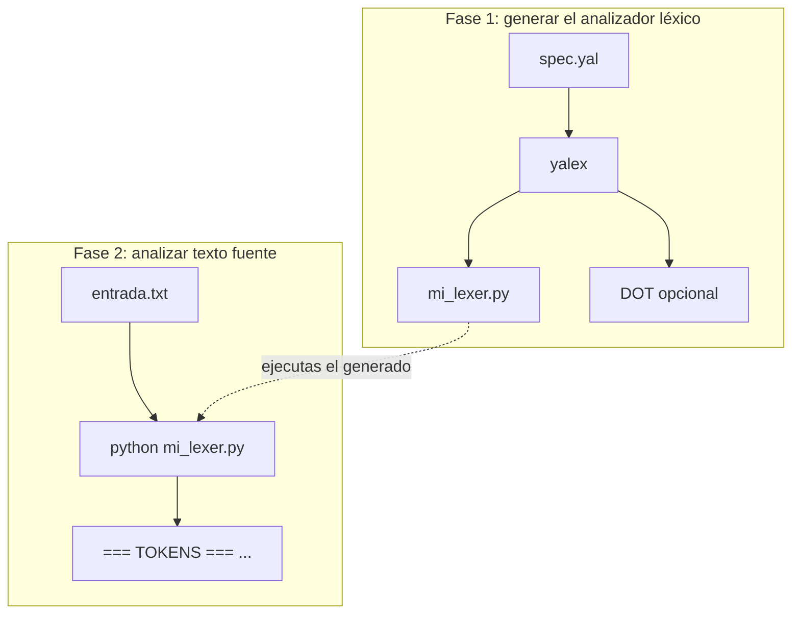

# YALex — Yet Another Lex Generator

Generador de analizadores léxicos que lee especificaciones `.yal` (sintaxis inspirada en ocamllex/Lex) y produce analizadores léxicos en Python autónomos.

**Repositorio:** [github.com/lfmendoza/lexer-generator](https://github.com/lfmendoza/lexer-generator)

## Configuración del entorno

Resumen rápido: instala **Python 3.10+** y **Git**, clona el repositorio, crea un entorno virtual (`.venv`), ejecuta `pip install -e ".[dev]"` y comprueba con `pytest`. El proyecto solo añade dependencias de desarrollo en `[dev]`; el generador y el código que emite usan la biblioteca estándar de Python.

| Sección | Contenido |
|---------|-----------|
| [Requisitos previos](#requisitos-previos) | Qué instalar antes de empezar |
| [Clonar el repositorio](#clonar-el-repositorio) | `git clone` |
| [Windows](#windows) | PowerShell, CMD y Git Bash |
| [macOS](#macos) | Terminal y Homebrew |
| [Linux](#linux) | Debian/Ubuntu, Fedora, Arch |
| [Comprobar la instalación](#comprobar-la-instalación) | Pruebas y herramientas opcionales |

### Requisitos previos

- **Python** 3.10 o superior ([Windows](https://www.python.org/downloads/windows/) · [macOS](https://www.python.org/downloads/macos/) · Linux: gestor de paquetes de la distro).
- **Git**, para clonar [el repositorio](https://github.com/lfmendoza/lexer-generator).

En Windows, al instalar Python desde el instalador oficial, marca **Add python.exe to PATH**. También puedes usar `winget install Python.Python.3.12`.

### Clonar el repositorio

```bash
git clone https://github.com/lfmendoza/lexer-generator.git
cd lexer-generator
```

A partir de aquí, todos los comandos se ejecutan **dentro** de la carpeta `lexer-generator` (raíz del proyecto).

---

### Windows

Instala Python si aún no lo tienes (véase [Requisitos previos](#requisitos-previos)). Luego elige **una** terminal; los tres métodos crean el mismo entorno virtual (`.venv`); solo cambia la forma de activarlo.

#### PowerShell (recomendado)

1. Abre **Windows Terminal → PowerShell** o busca “PowerShell” en el menú Inicio.
2. Ve al directorio del clon (ajusta la ruta):

   ```powershell
   cd C:\ruta\a\lexer-generator
   ```

3. Crea y activa el entorno virtual:

   ```powershell
   py -3 -m venv .venv
   .\.venv\Scripts\Activate.ps1
   ```

   Si aparece un error de **política de ejecución** (`running scripts is disabled`), ejecuta una vez en PowerShell **como administrador**:

   ```powershell
   Set-ExecutionPolicy -ExecutionPolicy RemoteSigned -Scope CurrentUser
   ```

   Cierra y vuelve a abrir la terminal, luego repite el paso 3.

4. Instala el proyecto:

   ```powershell
   python -m pip install -U pip
   pip install -e ".[dev]"
   ```

#### Símbolo del sistema (CMD)

1. Abre **cmd** (`Win + R` → `cmd` → Intro).
2. Cambia al directorio del proyecto:

   ```cmd
   cd /d C:\ruta\a\lexer-generator
   ```

3. Entorno virtual e instalación:

   ```cmd
   py -3 -m venv .venv
   .venv\Scripts\activate.bat
   python -m pip install -U pip
   pip install -e ".[dev]"
   ```

#### Git Bash

Útil si ya usas [Git for Windows](https://git-scm.com/download/win). Las rutas siguen el estilo Unix (`/c/Users/...`).

1. Abre **Git Bash**.
2. Ve al repositorio y activa el entorno (Git Bash usa `Scripts/activate` sin extensión):

   ```bash
   cd /c/ruta/a/lexer-generator
   py -3 -m venv .venv
   source .venv/Scripts/activate
   python -m pip install -U pip
   pip install -e ".[dev]"
   ```

   Si `py` no existe, prueba `python` o `python3` según lo que tengas en PATH.

#### Windows: comprobar y herramientas opcionales

- Comprueba la CLI: `yalex --help`, `python -m yalex --help`, o sin venv: `python yalex_cli.py --help`.
- **Graphviz** (opcional, para PNG desde `.dot`): [instalador](https://graphviz.org/download/) o `winget install Graphviz.Graphviz`; comprueba que `dot` esté en el PATH.
- **Make** no viene con Windows. Para los mismos pasos que `make check`, usa la sección [Desarrollo](#desarrollo) a mano, o instala `make` con [Chocolatey](https://chocolatey.org/) (`choco install make`) o [Scoop](https://scoop.sh/).

---

### macOS

#### Terminal (instalador oficial de Python o python.org)

1. Abre **Terminal** (`Aplicaciones → Utilidades`).
2. En la carpeta del clon:

   ```bash
   cd ~/ruta/a/lexer-generator
   python3 -m venv .venv
   source .venv/bin/activate
   python -m pip install -U pip
   pip install -e ".[dev]"
   ```

#### Con Homebrew (opcional)

Si gestionas Python con [Homebrew](https://brew.sh/):

```bash
brew install python@3.12
# luego crea el venv con la ruta que muestre brew, p. ej.:
cd ~/ruta/a/lexer-generator
python3 -m venv .venv
source .venv/bin/activate
pip install -U pip
pip install -e ".[dev]"
```

- **Graphviz** (opcional): `brew install graphviz`.
- **Make**: suele estar disponible tras instalar las herramientas de línea de comandos: `xcode-select --install`.

---

### Linux

Los pasos comunes son: paquetes del sistema (Python, `venv`, pip) → `cd` al clon → `python3 -m venv .venv` → `source .venv/bin/activate` → `pip install -e ".[dev]"`.

#### Debian / Ubuntu y derivados (Linux Mint, Pop!_OS, WSL2 Ubuntu, etc.)

```bash
sudo apt update
sudo apt install -y python3 python3-venv python3-pip graphviz build-essential git
cd ~/ruta/a/lexer-generator
python3 -m venv .venv
source .venv/bin/activate
pip install -U pip
pip install -e ".[dev]"
```

#### Fedora / RHEL / CentOS Stream (con `dnf`)

```bash
sudo dnf install -y python3 python3-pip graphviz gcc git
cd ~/ruta/a/lexer-generator
python3 -m venv .venv
source .venv/bin/activate
pip install -U pip
pip install -e ".[dev]"
```

#### Arch Linux

```bash
sudo pacman -S python python-pip graphviz base-devel git
cd ~/ruta/a/lexer-generator
python -m venv .venv
source .venv/bin/activate
pip install -U pip
pip install -e ".[dev]"
```

---

### Comprobar la instalación

Con el entorno virtual **activado** y estando en la raíz del repositorio:

```bash
pytest tests/ -q
python yalex_cli.py specs/yal/arithmetic_expression.yal -o _test_lexer --no-trees --no-dfa-graph -q
```

Opcional: `pre-commit install` (hooks de Ruff al hacer `git commit`; requiere `[dev]` instalado).

## Estructura del proyecto

```
src/yalex/
specs/yal/                    # especificaciones léxicas (.yal)
  arithmetic_expression.yal   # expresiones y asignación (curso / pruebas)
  imperative_core.yal         # lenguaje imperativo amplio (reservadas, literales, operadores)
samples/inputs/               # entradas de ejemplo para los lexers generados
  arithmetic_expressions.txt
  imperative_core_sample.txt
yalex_cli.py
pyproject.toml
tests/
```

Tras [configurar el entorno](#configuración-del-entorno), ejecuta: `yalex`, `python -m yalex` o `python yalex_cli.py`.

## Cómo funciona YALex (visión general)

Hay **dos programas distintos** y **dos fases** en el flujo de trabajo habitual:

| Fase | Herramienta | Entrada | Salida principal |
|------|-------------|---------|------------------|
| **1** | `yalex` (este repositorio) | Archivo `.yal` | **Lexer en Python** (`*.py`) + opcionalmente DOT (árboles, AFD) |
| **2** | El **lexer generado** (`python mi_lexer.py …`) | Archivo de texto de tu lenguaje | **Lista de tokens** impresa en consola |



**Fase 1 (compilación del lexer)** — internamente, `yalex` aplica la teoría habitual de compiladores:

1. Lee el `.yal` (cabecera, `let`, reglas `rule`, trailer).
2. Parsea cada regex a un AST.
3. Construye AFN (Thompson), los une, obtiene AFD (subconjuntos), minimiza (Hopcroft).
4. Escribe un `.py` con tablas del AFD y el código de acciones que definiste.
5. Opcionalmente escribe **DOT** para visualizar árboles de regex y el AFD.

**Fase 2 (ejecución)** — el `.py` generado recorre el texto con el AFD (prefijo más largo) y ejecuta la **acción** de la regla que gana: lo que devuelvas (`return …`) es lo que **aparece como token** en la salida (salvo `None`, que se omite).

---

## ¿Valida el programa que el texto “cumple” la especificación?

Hay que separar **dos niveles**:

| Nivel | Qué comprueba | Quién lo hace |
|-------|----------------|---------------|
| **Léxico** | ¿Cada trozo del texto se puede clasificar como uno de los patrones del `.yal` (o ignorar como espacio/comentario según reglas)? | El **lexer generado** |
| **Sintáctico / semántico** | ¿La secuencia de tokens forma frases válidas del lenguaje (gramática BNF, tipos, etc.)? | **No** lo hace YALex; corresponde a un **parser** u otra herramienta |

- **Sí** puedes comprobar si el texto **encaja a nivel léxico** con la especificación: ejecutas el lexer generado y observas si aparecen **errores léxicos** (caracteres que no inician ningún token reconocido) o solo tokens esperados.
- **No** el generador `yalex` no “valida” un archivo de entrada por sí mismo: solo **genera** el programa que leerá ese archivo más tarde.

**Estructura que obtienes al pasar el input por el lexer generado:** una **secuencia de tokens** en orden de lectura. Cada línea bajo `=== TOKENS ===` es una tupla que tú defines en las acciones `{ return … }`; lo habitual es algo como `(tipo, valor, línea, columna)` o `None` para ignorar (p. ej. espacios).

---

## Formato de salida: leer la lista de tokens

1. El script generado imprime un encabezado `=== TOKENS ===`.
2. Cada token es una tupla (el **contenido** depende de lo que pongas en `return` en el `.yal`).
3. Al final suele aparecer una línea con el **conteo** de tokens no nulos.
4. Los tokens con `return None` (p. ej. espacios) **no** se listan como líneas sueltas; solo cuentan a efectos de “limpiar” el texto.

Si necesitas **traza por token** al analizar, puedes temporalmente cambiar una acción a `print(...)` antes del `return`, o procesar el resultado en Python importando la clase `Lexer` del archivo generado (misma biblioteca estándar).

---

## Uso paso a paso

### 1. Generar el lexer desde `.yal`

```bash
yalex specs/yal/arithmetic_expression.yal -o my_lexer
# equivalente: python yalex_cli.py specs/yal/arithmetic_expression.yal -o my_lexer
```

Genera `my_lexer.py`, carpeta `my_lexer_trees/` (DOT de árboles de regex) y `my_lexer_dfa.dot` (salvo que uses `--no-trees` / `--no-dfa-graph`).

**Otro ejemplo** (lenguaje imperativo más grande):

```bash
yalex specs/yal/imperative_core.yal -o imp_lexer
python imp_lexer.py samples/inputs/imperative_core_sample.txt
```

### 2. Ejecutar el lexer sobre tu texto

```bash
python my_lexer.py samples/inputs/arithmetic_expressions.txt
```

Salida típica:

```
=== TOKENS ===
('ID', 'x', 1, 1)
('ASSIGN', '=', 1, 3)
('NUMBER', 3, 1, 5)
('PLUS', '+', 1, 7)
('NUMBER', 42, 1, 9)
...
```

### 3. Convertir DOT a PNG (opcional)

Necesitas el programa **`dot`**, incluido en [Graphviz](https://graphviz.org/) (no forma parte de Python ni de YALex).

```bash
dot -Tpng my_lexer_dfa.dot -o my_lexer_dfa.png
dot -Tpng my_lexer_trees/combined.dot -o combined_tree.png
```

**Si aparece `dot: command not found` (o equivalente):** Graphviz no está instalado o la carpeta del ejecutable no está en el `PATH`.

| Sistema | Cómo instalar (ejemplos) | Después |
|---------|---------------------------|---------|
| **Windows** | Instalador desde [graphviz.org](https://graphviz.org/download/) (marca “Add to PATH”), o `winget install Graphviz.Graphviz` | Cierra y abre la terminal; en PowerShell: `dot -V` |
| **macOS** | `brew install graphviz` | `dot -V` |
| **Debian/Ubuntu** | `sudo apt install graphviz` | `dot -V` |
| **Fedora** | `sudo dnf install graphviz` | `dot -V` |
| **Arch** | `sudo pacman -S graphviz` | `dot -V` |

En **Git Bash** bajo Windows, si instalaste Graphviz pero sigue sin encontrarse, reinicia la terminal o añade manualmente la ruta típica `C:\Program Files\Graphviz\bin` a las variables de entorno del sistema.

Los archivos `.dot` siguen siendo **texto**: puedes abrirlos en un editor o subirlos a [edotor.net](https://edotor.net/) u otro visor online si no quieres instalar Graphviz.

---

## Trazas y depuración detallada

### Durante `yalex` (compilación del lexer)

Aquí **sí** hay trazas estructuradas del **pipeline de generación**:

| Mecanismo | Qué muestra |
|-----------|-------------|
| **Salida por defecto** | Resumen: definiciones, reglas, pasos “Building NFA…”, tamaño del AFD, rutas generadas. |
| **`-v` / `--verbose`** | Más mensajes de registro (`logging`) del proceso. |
| **`-q` / `--quiet`** | Oculta parte del ruido y líneas `[INFO]` de archivos generados. |
| **`--trace human`** | Líneas `[trace] EVENTO clave=valor ...` con hitos del pipeline (ver tabla siguiente). |
| **`--trace json`** | Una línea JSON por evento (útil para scripts o `jq`). |
| **`--trace off`** | Desactiva trazas estructuradas (por defecto). |

**Eventos que se registran en la traza** (compilación):

| Evento | Información útil (ejemplos) |
|--------|------------------------------|
| `SPEC_PARSED` | Número de `let`, reglas, nombre del punto de entrada (`entrypoint`). |
| `TREES_EMITTED` | Directorio donde quedaron los DOT de árboles (si no usaste `--no-trees`). |
| `DFA_MINIMIZED` | Número de estados del AFD tras minimizar. |
| `DFA_DOT_WRITTEN` | Ruta del `.dot` del AFD (si no usaste `--no-dfa-graph`). |
| `CODE_WRITTEN` | Ruta del `.py` del lexer generado. |

**Ejemplo de comando con traza legible:**

```bash
yalex specs/yal/arithmetic_expression.yal -o my_lexer --trace human
```

**Ejemplo en JSON** (una línea por evento):

```bash
yalex specs/yal/arithmetic_expression.yal -o my_lexer --trace json
```

### Durante el lexer generado (tu texto de entrada)

El **`.py` generado** no incluye un modo `--trace` integrado: la “traza” práctica es la **lista impresa de tokens** (`=== TOKENS ===`). Para depuración fina puedes:

- Añadir `print(...)` en las acciones del `.yal` y **volver a generar** el lexer, o
- Usar el lexer como clase desde Python y recorrer los resultados en código.

---

## Opciones de línea de comandos (`yalex`)

| Opción | Descripción |
|--------|-------------|
| `-o NOMBRE` | Prefijo de salida (sin extensión `.py`) |
| `--no-trees` | No generar DOT de árboles de expresiones |
| `--no-dfa-graph` | No generar el diagrama DOT del AFD |
| `-v` / `--verbose` | Registro más detallado (logging) durante la generación |
| `-q` / `--quiet` | Salida mínima (oculta líneas `[INFO]` de codegen/DOT) |
| `--trace human` | Trazas `[trace]` legibles durante la **compilación** del lexer |
| `--trace json` | Trazas en JSON (una línea por evento) |
| `--trace off` | Sin trazas estructuradas (por defecto) |

## Referencia de sintaxis YALex

### Estructura del archivo

```
(* comentarios *)
{ cabecera opcional en Python }
let nombre = regex
...
rule punto_de_entrada =
    patron   { accion }
  | patron   { accion }
  ...
{ cola opcional en Python }
```

### Sintaxis de expresiones regulares

| Sintaxis | Significado |
|----------|-------------|
| `'c'` | Literal de un carácter |
| `'\n'` | Secuencia de escape |
| `_` | Cualquier carácter |
| `"abc"` | Cadena (concatenación de caracteres) |
| `['a'-'z']` | Clase de caracteres con rango |
| `['a' 'b' 'c']` | Clase de caracteres (conjunto) |
| `[^'0'-'9']` | Clase negada |
| `r1 \| r2` | Unión (alternancia) |
| `r1 r2` | Concatenación |
| `r*` | Estrella de Kleene |
| `r+` | Cierre positivo |
| `r?` | Opcional |
| `r1 # r2` | Diferencia de conjuntos |
| `(r)` | Agrupación |
| `eof` | Fin de archivo |
| `ident` | Referencia a una definición `let` |

### Precedencia de operadores (de mayor a menor)

1. `#` (diferencia de conjuntos)
2. `*`, `+`, `?`
3. Concatenación
4. `|` (unión)

### Acciones

Las acciones son bloques de código Python entre `{ }`. Variables disponibles:

- `lxm` — lexema coincidente (cadena)
- `lexeme` — igual que `lxm`
- `line` — número de línea donde empieza la coincidencia
- `col` — columna donde empieza la coincidencia
- `lexbuf` — referencia al objeto `Lexer`

Devolver `None` omite el token (p. ej. espacios). Cualquier otro valor se emite como token.

## Comportamiento (resumen)

- **Compilación (`yalex`):** ver la lista numerada en [Cómo funciona YALex](#cómo-funciona-yalex-visión-general) y las trazas en [Trazas y depuración detallada](#trazas-y-depuración-detallada).
- **Análisis de texto:** el lexer emitido aplica **prefijo más largo**; si dos reglas empatan en longitud, gana la que **aparece antes** en el `rule … =`.
- **Nombre del punto de entrada:** no use `rule tokens =` como entrada principal: en el código generado choca con el atributo `Lexer.tokens` (lista). Prefiera `gettoken`, `tokenize`, etc.
- **Dependencias:** solo biblioteca estándar de Python en este proyecto y en el código que genera YALex.

## Requisitos

- Python 3.10 o superior
- Graphviz (opcional, para convertir DOT a PNG)

## Desarrollo

```bash
make install
make check
pre-commit install
```

Sin `make` (p. ej. Windows): `pip install -e ".[dev]"`, luego `ruff check src tests yalex_cli.py`, `mypy src/yalex`, `pytest`.

## Información del curso

CC3071 — Diseño de Lenguajes de Programación  
Universidad del Valle de Guatemala  
Facultad de Ingeniería — Departamento de Ciencia de la Computación
